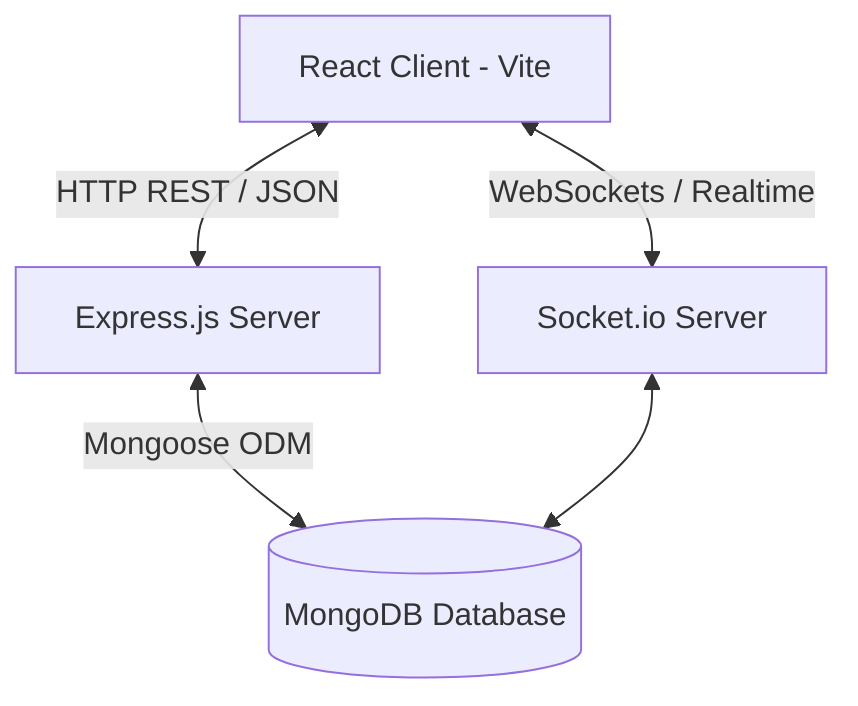

# 🏢 Apartment Hub — Smart Apartment Management System

Welcome to **Apartment Hub**, a premium, real-time, hybrid monolithic & event-driven management system designed for modern smart apartments. This platform facilitates seamless communication, maintenance request dispatching, billing/payments, community polling, and notices between building administrators and residents.

---

## ⚡ Key Features

### 👤 User Roles
* **Admin Dashboard:** Access all requests, allocate technicians, post building-wide announcements, launch polls, create maintenance bills, and respond to complaints.
* **Resident Dashboard:** Submit maintenance requests (with image attachments), pay pending dues, vote on active polls, view announcements, and register complaints.

### 🔌 Real-Time Layer
* Integrated **Socket.io** event layer for real-time community notices, system alerts, and instant dashboard syncs without needing page reloads.

### 🛠️ Maintenance & Logistics
* Custom status pipelines (Pending ➡️ In Progress ➡️ Completed) with technician assignment details (Name, Contact No.) for maintenance issues.

---

## 🔤 Programming & Markup Languages Used

The project is built entirely using modern web standards, emphasizing type safety and styling flexibility:

* **TypeScript (`.ts`, `.tsx`):** Used for both Frontend (React) and Backend (Express). It provides static typing, autocompletion, and catches potential code errors at compile-time instead of runtime.
* **JavaScript (ES6+):** The base execution language for the entire Node.js runtime and web browser.
* **HTML5:** Used as the structural entry point for the React single-page application (`index.html`).
* **CSS3 (Vanilla + Tailwind Utility Classes):** Used for maximum layout responsiveness, interactive hover animations, and custom theme layouts.

---

## 🛠️ Developer Tools & Frameworks

The application's ecosystem relies on standard, industry-grade tools divided between development, database, and servers:

### 1. Database & Services
* **MongoDB:** A document-oriented NoSQL database used to store application records (users, tickets, notices, payments) in flexible JSON-like documents.
* **Mongoose ODM:** An Object Document Mapper (library) for Node.js that applies schemas and structure to raw MongoDB collections.
* **Homebrew (`brew`):** Used to download, manage, and start the local MongoDB service (`mongodb-community`) on macOS.
* **MongoDB Shell (`mongosh`):** The terminal utility used to run database queries directly.

### 2. Backend (Server)
* **Node.js & Express.js:** The JavaScript runtime and lightweight server framework used to build the REST API endpoints.
* **Socket.io:** A WebSocket library enabling real-time, bi-directional communication between the server and client (used for instant noticeboard/alert updates).
* **ts-node-dev:** A development tool that compiles TypeScript files in memory and automatically restarts the backend server whenever code changes are saved.
* **Bcrypt.js:** A hashing library used to secure user passwords in the database.

### 3. Frontend (Client)
* **Vite:** A next-generation build tool that serves the React frontend locally with ultra-fast Hot Module Replacement (HMR).
* **React 18:** The frontend UI library using component-based architecture and React hooks (`useState`, `useEffect`, `useContext`) for state management.
* **Shadcn UI & Tailwind CSS:** UI libraries used to create clean, responsive components (buttons, cards, inputs, dialog modals) with unified styling tokens.
* **Axios:** A promise-based HTTP client used to send REST requests to the backend with automated JWT token attachment for session security.

---

## 🏗️ Architecture & Technical Design

Apartment Hub is designed using a **Monolithic + Event-Driven hybrid architecture**. A single Express backend manages transactions, while a Socket.io websocket connection ensures instant client-side state synchronization.



### Key Architectural Concepts
* **Hybrid Monolith:** Having the frontend and backend in one repository structure simplifies deployment, minimizes latency, and keeps database models directly aligned with the business logic.
* **Event-Driven Real-Time Sync:** By incorporating **WebSockets (Socket.io)**, the app doesn't require users to refresh their pages to get notices or ticket status changes. The server broadcasts updates immediately to connected clients.
* **Commercial Viability:** The project utilizes standard corporate design patterns: secure session control via JSON Web Tokens (JWT), hashed database secrets, separation of administrative privileges, and dynamic component styling.

---

## 🗄️ Database Collections (MongoDB)

The `apartment_hub` database uses the following schemas:

1. **`users`**: Profiles containing name, hashed password, role (`admin` or `resident`), unit number, and building metadata.
2. **`maintenancerequests`**: Tickets tracking resident issues, category, priority, status, assigned technician, and optional image links.
3. **`payments`**: Resident maintenance bills, payment dates, amounts, transaction IDs, and statuses (`Pending` or `Paid`).
4. **`notices`**: Interactive noticeboard announcements posted by administrators.
5. **`complaints`**: Resident grievances and corresponding management resolutions.
6. **`polls`**: Democratic building votes with option tallies.
7. **`events`**: Calendar items and social invitations.

---

## 🚀 Setup & Execution Guide

### 📋 Prerequisites
Ensure you have the following installed on your machine:
* [Node.js (v18+)](https://nodejs.org/)
* [Homebrew](https://brew.sh/) (for MongoDB installation on macOS)

---

### 📦 Installation

Clone the repository and install the dependencies for both client and server:

```bash
# 1. Navigate to the project root directory
cd "/Users/pavulurusudharshanchowdary/apartment-hub-main 1"

# 2. Install Frontend dependencies
npm install

# 3. Install Backend dependencies
cd server && npm install
```

---

### 🏃 Running the Application

Always run the database first, followed by the servers.

#### **Step 1: Start MongoDB**
```bash
brew services start mongodb-community
```

#### **Step 2: Start Backend Server (Tab 1)**
Open a new Terminal tab and run:
```bash
cd "/Users/pavulurusudharshanchowdary/apartment-hub-main 1/server"
npm run dev
```
*Runs on [http://localhost:5000](http://localhost:5000)*

#### **Step 3: Start Frontend Client (Tab 2)**
Open another Terminal tab and run:
```bash
cd "/Users/pavulurusudharshanchowdary/apartment-hub-main 1"
npm run dev
```
*Runs on [http://localhost:8080](http://localhost:8080)*

#### **Alternative (Single-Command Start)**
You can also launch both client and server simultaneously using `concurrently`:
```bash
cd "/Users/pavulurusudharshanchowdary/apartment-hub-main 1"
npm start
```

---

## 🔑 Default Demo Accounts

The database seeds itself automatically on first launch. You can use these credentials to log in:

| Role | Email Address | Password | Details |
| :--- | :--- | :--- | :--- |
| **Administrator** | `admin@apt.com` | `admin123` | Full dashboard management access |
| **Resident** | `resident@apt.com` | `resident123` | Standard resident utility access |

---

## 🛠️ Troubleshooting

### 1. `EADDRINUSE: address already in use :::5000` or `:::8080`
This happens when a previous node server process did not close completely. Run this command to kill the old processes:
```bash
lsof -ti :5000 | xargs kill -9; lsof -ti :8080 | xargs kill -9
```

### 2. MongoDB connection errors on start
If the backend crashes with a Mongoose connection error, make sure the MongoDB daemon is active:
```bash
brew services list
```
If `mongodb-community` is stopped, start it:
```bash
brew services start mongodb-community
```

### 3. Debugging Frontend Login Failures
If you submit your credentials on the web UI and receive a login error, check the browser console for details:
* Right-click anywhere on the webpage and select **Inspect**.
* Click the **Console** tab.
* Retype your password and click **Login** to see the raw error code (e.g. CORS block, server offline, or invalid hash verification).